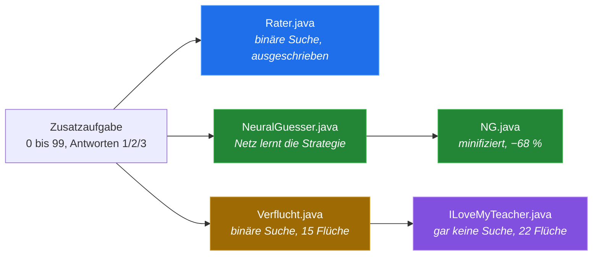

# Zahlenraten, rückwärts

*[English](README.md) · [Deutsch](README.de.md)*

> Die Hauptfassung dieses README ist die **[englische](README.md)**. Diese Seite ist
> ihre deutsche Entsprechung und beschreibt dieselben Programme.

**Fünf Java-Lösungen für dieselbe Schulaufgabe — jede auf Deutsch und auf
Englisch.** Von «so sollte man es schreiben» über «ein neuronales Netz findet die
Strategie selber» bis «dieses Programm sucht überhaupt nicht».

> **Zusatzaufgabe:** Schreibe ein Programm, das das Gegenteil des üblichen
> Ratespiels macht — **der Computer errät die Zahl, die sich der Mensch ausgedacht
> hat.** Bereich 0 bis 99. Der Mensch antwortet `1` für richtig, `2` für kleiner
> und `3` für grösser.
>
> *«Das grenzt schon fast an künstliche Intelligenz!»*


Alle zehn Programme verhalten sich **von aussen identisch**: gleiche Texte,
gleicher Ablauf, gleiche Schummelerkennung, gleiche Wiederholschleife. Alle
brauchen **nichts ausser dem JDK** — keine Bibliothek, kein Maven, keinen
Build-Schritt. Nur der Weg dorthin ist ein anderer.

## Schnellstart

```sh
java src/de/Rater.java              # die normale Lösung
java src/de/NeuralGuesser.java      # neuronales Netz, trainiert bei jedem Start neu
java src/de/NG.java                 # dasselbe, minifiziert
java src/de/Verflucht.java          # verflucht, aber vollständig definiert
java src/de/ILoveMyTeacher.java     # verfluchter
```

`de` durch `en` ersetzen für die englischen Fassungen:

```sh
java src/en/Rater.java
```

Benötigt **Java 11+**; `ILoveMyTeacher.java` braucht **Java 15+** (Text-Blöcke).
Getestet auf OpenJDK 21.0.2.

## Die fünf Versionen



| Datei | Pointe | Methode | Bytes | Zeilen | Beschreibung |
|---|---|---|---:|---:|---|
| **`Rater.java`** | Wie man es schreiben sollte | Binäre Suche, ausgeschrieben | 5,349 | 162 | [→](docs/01-rater.md) |
| **`NeuralGuesser.java`** | «Mit KI lösen», lesbar | Neuronales Netz, lernt selber | 21,365 | 488 | [→](docs/02-neuralguesser.md) |
| **`NG.java`** | So klein wie möglich | Identisch, minifiziert | 6,725 | 102 | [→](docs/03-ng.md) |
| **`Verflucht.java`** | So pervers wie möglich | Binäre Suche, 15 Flüche | 10,404 | 231 | [→](docs/04-verflucht.md) |
| **`ILoveMyTeacher.java`** | Schlimmer | *Gar keine Suche*, 22 Flüche | 14,096 | 303 | [→](docs/05-ilovemyteacher.md) |

Byte- und Zeilenzahlen gelten für die deutschen Fassungen in `src/de/`; die
englischen in `src/en/` sind ein paar hundert Bytes kürzer (kürzere Wörter,
derselbe Code).

> Die ausführlichen Beschreibungen unter `docs/` sind auf Englisch.

## Alle zehn spielen gleich gut

Automatisch durch **alle 100 möglichen Zahlen** gespielt, in beiden Sprachen:

| Datei | Spr. | Alle 100 gefunden | min | Schnitt | max | Laufzeit | `javac -Xlint:all` |
|---|:--:|:---:|---:|---:|---:|---:|---:|
| `Rater.java` | de / en | ✅ | 1 | **5.80** | 7 | 0.4 s | 0 Warnungen |
| `NeuralGuesser.java` | de / en | ✅ | 1 | **5.80** | 7 | 4.6 s | 0 Warnungen |
| `NG.java` | de / en | ✅ | 1 | **5.80** | 7 | 4.6 s | 0 Warnungen |
| `Verflucht.java` | de / en | ✅ | 1 | **5.80** | 7 | 0.4 s | 4 Warnungen |
| `ILoveMyTeacher.java` | de / en | ✅ | 1 | **5.80** | 7 | 0.5 s | 3 Warnungen |

5.80 Versuche im Schnitt und nie mehr als 7 ist das **theoretische Optimum** für
100 Zahlen (2⁷ = 128 > 100). Die längere Laufzeit der ML-Versionen ist reines
Starttraining. Die Warnungen der verfluchten Versionen sind Absicht — jede zeigt
direkt auf einen Fluch.

→ [Wie gemessen wurde](docs/measurement.md) *(englisch)*

## Die Grundidee: binäre Suche

Der Computer merkt sich das Intervall, in dem die Zahl noch liegen kann, und rät
immer dessen Mitte. Jede falsche Antwort halbiert das Intervall.


Wird das Intervall **leer**, passt keine einzige Zahl mehr zu allen Antworten —
daher kommt die Schummelerkennung, gratis und ohne Zusatzcode.

## Das Netz findet die Mitte von selbst

`NeuralGuesser.java` bekommt die binäre Suche **nicht** beigebracht. Es erhält nur
das Intervall als Eingabe, gibt einen Anteil zwischen 0 und 1 aus und wird mit −1
pro Versuch bestraft. Den Rest erarbeitet es sich allein.


*Echte Messwerte aus einem Durchlauf.* `mu` ist der Anteil der Spanne, auf den das
Netz tippt. Er wandert von zufälligen 0.43 auf ≈ 0.50 — die Mitte. Das Netz hat
die binäre Suche wiederentdeckt.

## Und eine Version sucht gar nicht mehr

`ILoveMyTeacher.java` baut eine `AbstractList`, die **überhaupt keine Daten
enthält**, und ruft `Collections.binarySearch` mit dem Suchschlüssel `null` darauf
auf. Der Comparator fragt bei jedem Vergleich den Menschen.


**Der Mensch ist die durchsuchte Datenstruktur.** Der dokumentierte Vertrag der
Methode liefert den Index der Zahl zurück — und bei widersprüchlichen Antworten
einen negativen Einfügepunkt. Schummelerkennung, wieder gratis.

## Welche soll ich nehmen?

| Situation | Deutsch | English |
|---|---|---|
| Aufgabe verstehen, Lösung abgeben | [`Rater.java`](src/de/Rater.java) | [`Rater.java`](src/en/Rater.java) |
| Zeigen, dass ein Netz die Strategie selber findet | [`NeuralGuesser.java`](src/de/NeuralGuesser.java) | [`NeuralGuesser.java`](src/en/NeuralGuesser.java) |
| Zeigen, wie klein es geht | [`NG.java`](src/de/NG.java) | [`NG.java`](src/en/NG.java) |
| Zeigen, was die Java-Spec wirklich erlaubt | [`Verflucht.java`](src/de/Verflucht.java) | [`Verflucht.java`](src/en/Verflucht.java) |
| Sich an der Lehrperson rächen | [`ILoveMyTeacher.java`](src/de/ILoveMyTeacher.java) | [`ILoveMyTeacher.java`](src/en/ILoveMyTeacher.java) |

## Aufbau des Repositorys

```
src/de/   die fünf Programme, deutsch (das Original — das Aufgabenblatt ist deutsch)
src/en/   dieselben fünf, englisch
docs/     eine ausführliche Beschreibung pro Version (englisch)
media/    die Animationen (erzeugt von tools/media_bauen.py)
tools/    Testtreiber und Messskripte (beide Sprachen)
```

Die beiden Bäume verwenden **absichtlich identische Datei- und Klassennamen**. Das
ist kein Versehen, und es ist wichtig:

- `ILoveMyTeacher` benutzt den **eigenen Klassennamen als Entschlüsselungsschlüssel**
  für seine Stringtabelle (Fluch 1) und gibt ihn aus einem Shutdown-Hook wieder aus
  (Fluch 21). Ein Umbenennen der Klasse würde beides kaputt machen.
- Beschreibungen, Vergleichstabellen und Testtreiber bleiben zwischen den Sprachen
  eins zu eins, `docs/04-verflucht.md` beschreibt also `src/de/Verflucht.java` und
  `src/en/Verflucht.java` gleichzeitig.

Man kompiliert nie beide gleichzeitig, deshalb kollidieren die doppelten
Klassennamen nie — der Einzeldatei-Starter sieht immer nur den einen Pfad, den man
ihm übergibt.

## Bekannte Grenzen

- Bei `ILoveMyTeacher.java` garantiert der Vertrag von `Collections.binarySearch`
  das **Ergebnis** (Index bzw. negativer Einfügepunkt), nicht die konkrete Abfolge
  der Fragen. Der gemessene Worst Case von 7 Fragen gilt für OpenJDK; *korrekt* ist
  das Programm auf jeder konformen Implementierung.
- Die ML-Versionen trainieren bei jedem Start neu und ohne festen Seed, die
  Ergebnisse schwanken also leicht — bisher landete aber jeder Lauf auf dem Optimum.
- Die deutschen Quellen enthalten Umlaute und sind UTF-8. Java 18+ nimmt UTF-8 als
  Standard; auf älteren JDKs beim Kompilieren `-encoding UTF-8` mitgeben. Die
  englischen Quellen sind reines ASCII und brauchen das nicht.
