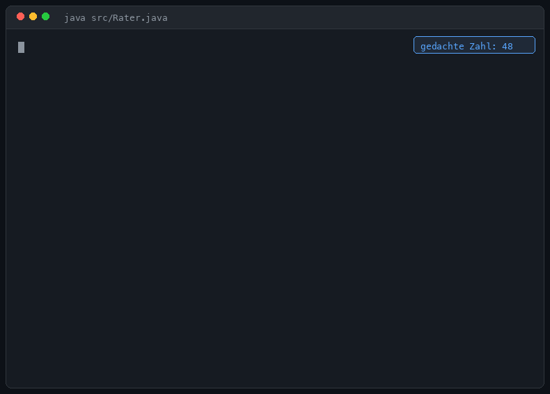
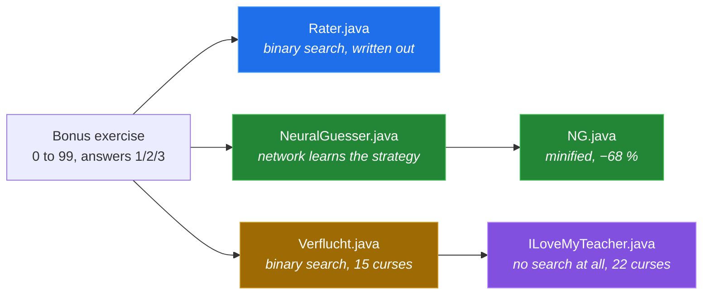
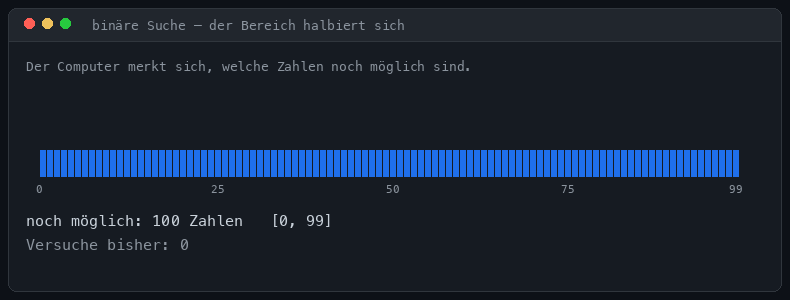

# Reverse Number Guessing

*[English](README.md) · [Deutsch](README.de.md)*

**Five Java solutions to the same school exercise — each one in German and in
English.** From "this is how you should write it", through "a neural network
discovers the strategy on its own", all the way to "this program does not search
at all".

> **Bonus exercise:** Write a program that does the opposite of the usual guessing
> game — **the computer guesses the number the human is thinking of.** Range 0 to
> 99. The human answers `1` for correct, `2` for smaller and `3` for larger.
>
> *"That's almost artificial intelligence!"*



All ten programs behave **identically from the outside**: same prompts, same
flow, same cheat detection, same replay loop. All of them need **nothing but the
JDK** — no library, no Maven, no build step. Only the road there differs.

## Quick start

```sh
java src/en/Rater.java              # the normal solution
java src/en/NeuralGuesser.java      # neural network, retrained on every launch
java src/en/NG.java                 # same thing, minified
java src/en/Verflucht.java          # cursed, but fully defined
java src/en/ILoveMyTeacher.java     # more cursed
```

Swap `en` for `de` to run the German originals — the exercise sheet is German, so
those came first:

```sh
java src/de/Rater.java
```

Requires **Java 11+**; `ILoveMyTeacher.java` needs **Java 15+** for text blocks.
Tested on OpenJDK 21.0.2.

## The five versions



| File | Point | Method | Bytes | Lines | Write-up |
|---|---|---|---:|---:|---|
| **`Rater.java`** | How you should write it | Binary search, spelled out | 5,118 | 161 | [→](docs/01-rater.md) |
| **`NeuralGuesser.java`** | "Solve it with AI", readably | Neural network, learns by itself | 21,083 | 488 | [→](docs/02-neuralguesser.md) |
| **`NG.java`** | As smol as possible | Identical, minified | 6,660 | 102 | [→](docs/03-ng.md) |
| **`Verflucht.java`** | As perverse as possible | Binary search, 15 curses | 9,978 | 229 | [→](docs/04-verflucht.md) |
| **`ILoveMyTeacher.java`** | Worse | *No search at all*, 22 curses | 13,483 | 296 | [→](docs/05-ilovemyteacher.md) |

Byte and line counts are for the English editions in `src/en/`; the German ones in
`src/de/` are within a few hundred bytes of them (longer words, same code).

## All ten play equally well

Driven automatically through **all 100 possible numbers**, in both languages:

| File | Lang | Found all 100 | min | mean | max | Runtime | `javac -Xlint:all` |
|---|:--:|:---:|---:|---:|---:|---:|---:|
| `Rater.java` | de / en | ✅ | 1 | **5.80** | 7 | 0.4 s | 0 warnings |
| `NeuralGuesser.java` | de / en | ✅ | 1 | **5.80** | 7 | 4.6 s | 0 warnings |
| `NG.java` | de / en | ✅ | 1 | **5.80** | 7 | 4.6 s | 0 warnings |
| `Verflucht.java` | de / en | ✅ | 1 | **5.80** | 7 | 0.4 s | 4 warnings |
| `ILoveMyTeacher.java` | de / en | ✅ | 1 | **5.80** | 7 | 0.5 s | 3 warnings |

5.80 guesses on average and never more than 7 is the **theoretical optimum** for
100 numbers (2⁷ = 128 > 100). The extra runtime of the ML versions is pure
start-up training. The warnings on the cursed versions are deliberate — each one
points straight at a curse.

→ [How this was measured](docs/measurement.md)

## The underlying idea: binary search

The computer remembers the interval the target can still be in and always guesses
its midpoint. Every wrong answer halves the interval.



When the interval becomes **empty**, no number is consistent with all the answers
— which is where cheat detection comes from, for free, with no extra code.

## The network finds the midpoint by itself

`NeuralGuesser.java` is **not** taught binary search. It only gets the interval as
input, emits a fraction between 0 and 1, and is penalised −1 per guess. It works
out the rest alone.


*Real measurements from one run.* `mu` is the fraction of the span the network
guesses at. It drifts from a random 0.43 to ≈ 0.50 — the midpoint. The network
rediscovered binary search.

## And one of them stops searching entirely

`ILoveMyTeacher.java` builds an `AbstractList` that **contains no data at all** and
calls `Collections.binarySearch` on it with the search key `null`. The comparator
asks the human on every comparison.


**The human is the data structure being searched.** The documented contract of the
method hands back the index of the number — and, for contradictory answers, a
negative insertion point. Cheat detection, again for free.

## Which one should I use?

| Situation | English | Deutsch |
|---|---|---|
| Understand the exercise, hand in a solution | [`Rater.java`](src/en/Rater.java) | [`Rater.java`](src/de/Rater.java) |
| Show that a network can find the strategy itself | [`NeuralGuesser.java`](src/en/NeuralGuesser.java) | [`NeuralGuesser.java`](src/de/NeuralGuesser.java) |
| Show how small it goes | [`NG.java`](src/en/NG.java) | [`NG.java`](src/de/NG.java) |
| Show how much the Java spec actually permits | [`Verflucht.java`](src/en/Verflucht.java) | [`Verflucht.java`](src/de/Verflucht.java) |
| Get back at your teacher | [`ILoveMyTeacher.java`](src/en/ILoveMyTeacher.java) | [`ILoveMyTeacher.java`](src/de/ILoveMyTeacher.java) |

## Repository layout

```
src/de/   the five programs, German (the original — the exercise sheet is German)
src/en/   the same five, English
docs/     a detailed write-up per version (English)
media/    the animations (built by tools/media_bauen.py)
tools/    test drivers and measurement scripts (both languages)
```

The two trees use **identical file and class names** on purpose. It is not an
oversight, and it matters:

- `ILoveMyTeacher` uses its **own class name as the decryption key** for its string
  table (curse 1) and prints it back at you from a shutdown hook (curse 21).
  Renaming the class would break both.
- The write-ups, the comparison tables and the test drivers stay one-to-one
  between the languages, so `docs/04-verflucht.md` describes `src/de/Verflucht.java`
  and `src/en/Verflucht.java` at the same time.

You never compile both at once, so the duplicate class names never collide — the
single-file launcher only ever sees the one path you hand it.

## Known limitations

- For `ILoveMyTeacher.java`, the contract of `Collections.binarySearch` guarantees
  the **result** (index, or negative insertion point), not the particular sequence
  of questions. The measured worst case of 7 questions holds for OpenJDK; the
  program is *correct* on any conforming implementation.
- The ML versions retrain on every launch with no fixed seed, so results wobble
  slightly — but every run so far has landed on the optimum.
- The German sources contain umlauts and are UTF-8. Java 18+ defaults to UTF-8; on
  older JDKs pass `-encoding UTF-8` when compiling. The English sources are pure
  ASCII and need no such care.
