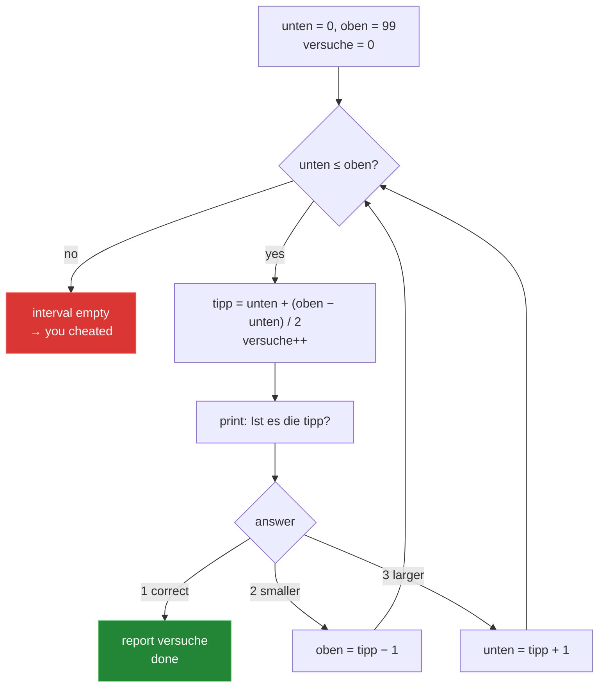

# 1 — `Rater.java`: the normal solution

[← back to the overview](../README.md) · [source](../src/Rater.java) · 162 lines · 5,349 bytes · 0 warnings

This is the version you would actually hand in. No tricks, no cleverness, German
Javadoc, one job per method.

```sh
java src/Rater.java
```

## How it works

The program keeps the interval `[unten, oben]` (lower, upper) that the target can
still be in and guesses its midpoint. Each answer shrinks the interval:

- `2` (smaller) → the upper bound moves to `tipp - 1`
- `3` (larger) → the lower bound moves to `tipp + 1`
- `1` (correct) → done



The loop body is the whole program:

```java
private static void spieleRunde() throws IOException {
    int unten = MIN, oben = MAX, versuche = 0;
    while (unten <= oben) {
        int tipp = unten + (oben - unten) / 2;   // Mitte, ohne Überlaufgefahr
        versuche++;
        OUT.println("Ist es die " + tipp + "?");
        switch (leseAntwort()) {
            case RICHTIG: melde(versuche); return;
            case KLEINER: oben  = tipp - 1; break;
            default:      unten = tipp + 1; break;
        }
    }
    OUT.println();
    OUT.println("Hmm, deine Antworten passen nicht zusammen. Hast du geschummelt?");
}
```

## Why the midpoint is optimal

Each question can only split the remaining candidates into two groups. To be sure
of finding the answer after *n* questions, at most 2ⁿ candidates may remain. For
100 numbers that means 2⁷ = 128 ≥ 100, so **7 questions in the worst case** — and
only splitting exactly down the middle achieves it. Any other split leaves a
larger worst-case half.

Averaged over all 100 numbers, this comes out at exactly **5.80** guesses.

## Details worth copying

**Overflow-safe midpoint.** `unten + (oben - unten) / 2` instead of
`(unten + oben) / 2`. It makes no difference for 0…99, but the naive form is the
classic binary-search bug that sat in the JDK itself for nine years.

**Cheat detection falls out of the loop.** No special case is needed. If the human
answers inconsistently, the interval eventually becomes empty, `unten > oben`, and
the loop simply ends.

**Explicit UTF-8.** The program writes umlauts, so it does not rely on the
platform default encoding:

```java
private static final PrintStream OUT = new PrintStream(
        new FileOutputStream(FileDescriptor.out), true, StandardCharsets.UTF_8);
private static final BufferedReader IN = new BufferedReader(
        new InputStreamReader(System.in, StandardCharsets.UTF_8));
```

**Clean end of input.** `readLine()` returning `null` (Ctrl-D, or a pipe running
dry) raises an `EOFException` that `main` catches, so a redirected run ends with a
farewell instead of a stack trace.

**Grammar.** One guess prints "1 Versuch", more than one prints "n Versuche". A
tiny thing, but a program that tells you "1 Versuche" looks unfinished.

## Measured

| | |
|---|---|
| all 100 numbers found | ✅ |
| guesses min / mean / max | 1 / 5.80 / 7 |
| runtime for 100 rounds | 0.4 s |
| `javac -Xlint:all` | 0 warnings |

→ [Next: `NeuralGuesser.java`](02-neuralguesser.md)
