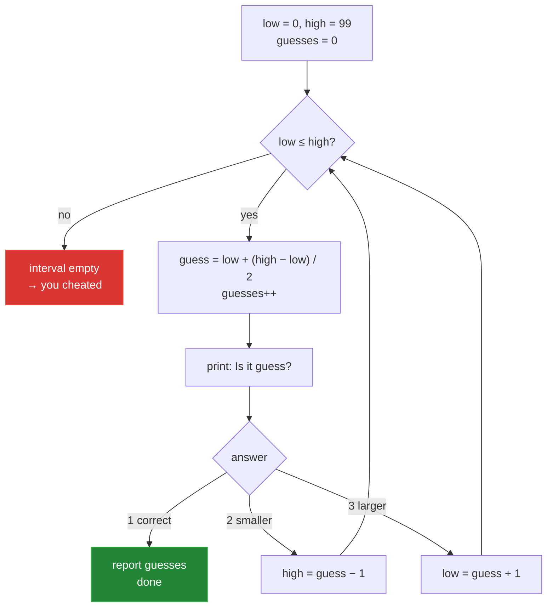

# 1 — `Rater.java`: the normal solution

[← back to the overview](../README.md) · source: [en](../src/en/Rater.java) · [de](../src/de/Rater.java) · 161 lines · 5,118 bytes · 0 warnings

This is the version you would actually hand in. No tricks, no cleverness, proper
Javadoc, one job per method. The snippets below are from `src/en/Rater.java`; the
German edition is the same code with German names and prompts.

```sh
java src/en/Rater.java
```

## How it works

The program keeps the interval `[low, high]` that the target can still be in and
guesses its midpoint. Each answer shrinks the interval:

- `2` (smaller) → the upper bound moves to `guess - 1`
- `3` (larger) → the lower bound moves to `guess + 1`
- `1` (correct) → done



The loop body is the whole program:

```java
private static void playRound() throws IOException {
    int low = MIN, high = MAX, guesses = 0;
    while (low <= high) {
        int guess = low + (high - low) / 2;   // midpoint, without overflow
        guesses++;
        OUT.println("Is it " + guess + "?");
        switch (readAnswer()) {
            case CORRECT: report(guesses); return;
            case SMALLER: high = guess - 1; break;
            default:      low  = guess + 1; break;
        }
    }
    OUT.println();
    OUT.println("Hmm, your answers don't add up. Did you cheat?");
}
```

## Why the midpoint is optimal

Each question can only split the remaining candidates into two groups. To be sure
of finding the answer after *n* questions, at most 2ⁿ candidates may remain. For
100 numbers that means 2⁷ = 128 ≥ 100, so **7 questions in the worst case** — and
only splitting exactly down the middle achieves it. Any other split leaves a
larger worst-case half.

Averaged over all 100 numbers, this comes out at exactly **5.80** guesses.

## Details worth copying

**Overflow-safe midpoint.** `low + (high - low) / 2` instead of
`(low + high) / 2`. It makes no difference for 0…99, but the naive form is the
classic binary-search bug that sat in the JDK itself for nine years.

**Cheat detection falls out of the loop.** No special case is needed. If the human
answers inconsistently, the interval eventually becomes empty, `low > high`, and
the loop simply ends.

**Explicit UTF-8.** Both editions pin the encoding rather than trusting the
platform default — the German one prints umlauts, and pinning it keeps the two
byte-for-byte comparable:

```java
private static final PrintStream OUT = new PrintStream(
        new FileOutputStream(FileDescriptor.out), true, StandardCharsets.UTF_8);
private static final BufferedReader IN = new BufferedReader(
        new InputStreamReader(System.in, StandardCharsets.UTF_8));
```

**Clean end of input.** `readLine()` returning `null` (Ctrl-D, or a pipe running
dry) raises an `EOFException` that `main` catches, so a redirected run ends with a
farewell instead of a stack trace.

**Grammar.** One guess prints "1 guess", more than one "n guesses" — and in
German, "1 Versuch" against "n Versuche". A tiny thing, but a program that tells
you "1 guesses" looks unfinished.

## Measured

| | |
|---|---|
| all 100 numbers found | ✅ |
| guesses min / mean / max | 1 / 5.80 / 7 |
| runtime for 100 rounds | 0.4 s |
| `javac -Xlint:all` | 0 warnings |

→ [Next: `NeuralGuesser.java`](02-neuralguesser.md)
