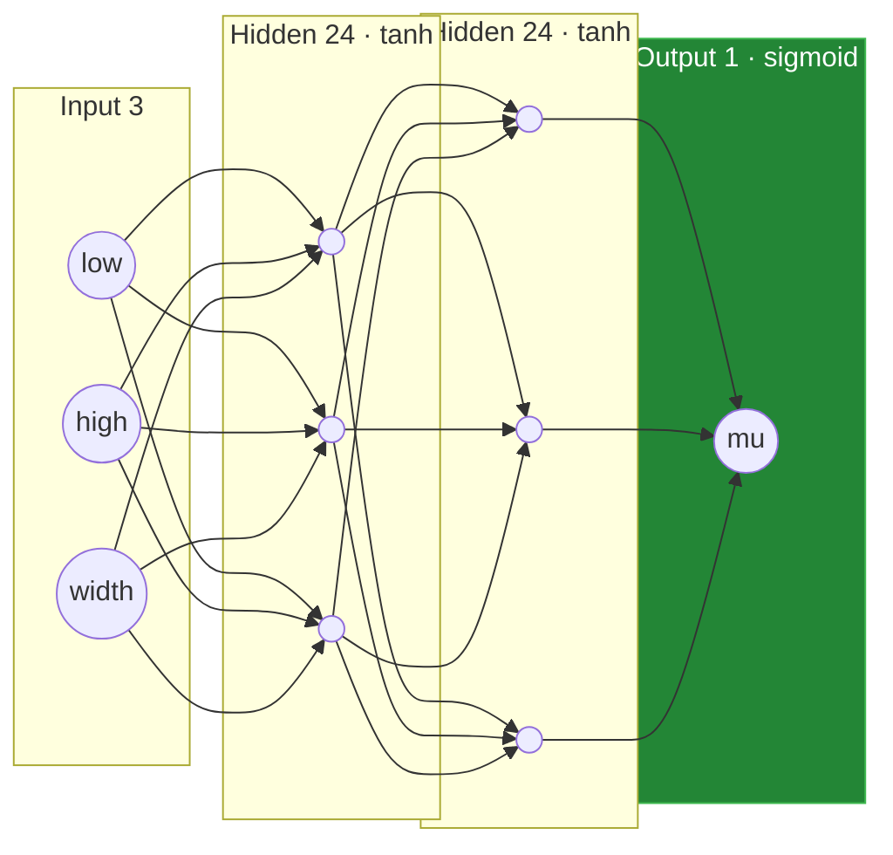
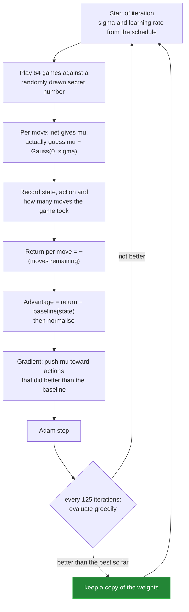
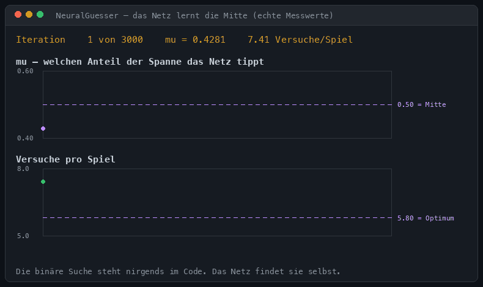

# 2 — `NeuralGuesser.java`: the network that teaches itself

[← back to the overview](../README.md) · source: [en](../src/en/NeuralGuesser.java) · [de](../src/de/NeuralGuesser.java) · 488 lines · 21,083 bytes · 0 warnings

The exercise sheet jokes that this "is almost artificial intelligence". So here is
the version that takes the joke literally: a multilayer perceptron with
hand-written backpropagation, trained fresh on every launch, entirely in memory,
using nothing but `java.util.Random` and `java.lang.Math`.

Nobody tells it about binary search. It figuwes that part out by itself.

```sh
java src/en/NeuralGuesser.java      # ≈ 4 seconds of training, then it plays
```

## What the network sees and says

| | |
|---|---|
| **Input** (3 values) | lower bound, upper bound, width of the interval — each scaled to 0…1 |
| **Output** (1 value) | `mu`: *where inside the interval to guess*, as a fraction from 0 to 1 |
| **Guess** | `guess = low + round(mu · (high − low))` |
| **Reward** | −1 per question asked. Nothing else. |

That reward is the entire specification of the task. "Ask as few questions as
possible" — never "halve the interval".



The sigmoid on the output is what makes the setup safe: `mu` can never leave
0…1, so the guess can never leave the interval, so the game always terminates.

## How it learns: REINFORCE

This is a reinforcement-learning problem, not a supervised one — there is no
"correct guess" to compare against, only a score at the end. The algorithm is
REINFORCE (policy gradient) in its plainest form.



The five pieces that make it converge:

**1. Gaussian exploration.** During training the network does not guess `mu`, it
guesses `mu + noise`. Without noise it would never discover that a different guess
would have been better. `sigma` anneals from 0.30 down to 0.06 — not to zero, or
learning stops dead.

**2. A per-state baseline.** Interval width is stored as the state key, and the
running mean return for that width is subtracted from the actual return. Wide
intervals cost more moves than narrow ones no matter how well you play; without
the baseline that difference drowns the real signal.

**3. Advantage normalisation.** After subtracting the baseline, the batch's
advantages are rescaled to unit variance, which keeps the gradient magnitude
stable across iterations.

**4. Schedules.** The learning rate follows a cosine decay from 0.01 to 0, `sigma`
decays linearly. Big steps early, fine polish later.

**5. Best-model tracking.** Every 125 iterations the network is evaluated
greedily (no noise). The best weights seen so far are kept, and that copy — not
the final state of training — is what plays against you. Policy gradients are
noisy; the last iteration is not reliably the best one.

## The actual machine learning

Everything is hand-written; there is no library to lean on.

**Forward pass** — `tanh` on the hidden layers, `sigmoid` on the output.

**Backward pass** — the chain rule, written out. For `tanh` the derivative is
`1 − a²`, and because the output is a sigmoid, the gradient of the Gaussian
log-likelihood collapses into something remarkably tidy:

```
dL/dmu = −advantage · (action − mu) / sigma²
dL/dz  = dL/dmu · mu · (1 − mu)          // sigmoid derivative
```

**Adam** with bias correction, `beta1 = 0.9`, `beta2 = 0.999`, gradients averaged
over the batch.

## Does it actually work?



Real numbers from one run. `mu` starts wherever the random initialisation puts it
— 0.43 here — and climbs to ≈ 0.50. The average number of guesses falls from 7.41
to 5.44 on the sampled evaluation.

Played out over all 100 numbers the result is exactly **1 / 5.80 / 7**: identical
to `Rater.java`, down to the last decimal.

> The network did not approximate binary search. It *is* binary search. Guessing
> the midpoint is the unique optimum, so any policy that reaches the optimum must
> guess the midpoint.

That is the honest punchline of this version: 21 KB of neural network to
rediscover four lines of code — but rediscover them it does, from a reward signal
alone.

## Why the self-reported average wobbles

The training report prints something like 5.75 or 5.85. That is sampling noise:
the evaluation plays a few thousand random games, not all 100 numbers exactly
once. The exhaustive measurement is the exact one, and it always says 5.80.

## Measured

| | |
|---|---|
| all 100 numbers found | ✅ |
| guesses min / mean / max | 1 / 5.80 / 7 |
| runtime for 100 rounds | 4.5 s (of which ≈ 4 s is training) |
| `javac -Xlint:all` | 0 warnings |

→ [Next: `NG.java`](03-ng.md)
