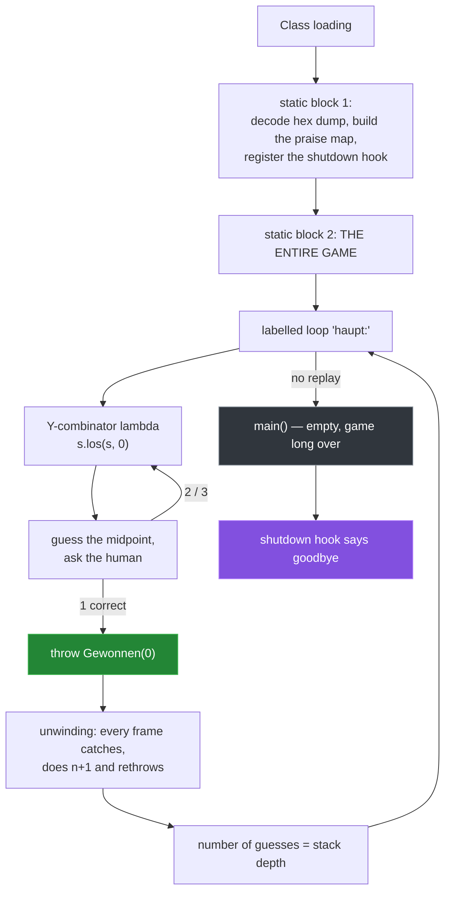

# 4 — `Verflucht.java`: fifteen curses, zero undefined behaviour

[← back to the overview](../README.md) · source: [en](../src/en/Verflucht.java) · [de](../src/de/Verflucht.java) · 229 lines · 9,978 bytes · 4 warnings *(deliberate)*

Still plain binary search. Still 1 / 5.80 / 7. But every single step is taken the
worst way the Java Language Specification permits.

**The rule this version follows:** every trick must be *exactly specified*. No
undefined behaviour, no JVM quirk, no reflection, no race condition, no reliance
on a particular compiler. Everything here behaves the same on every conforming
implementation. It is just deeply indecent.

```sh
java src/en/Verflucht.java
```

## Control flow

`main` is empty. The whole game runs in static initialisers, before `main` is ever
called, and each guess is a fresh stack frame of a lambda that was handed itself
as an argument.



## The fifteen curses

| # | Curse | Specified by |
|---:|---|---|
| 1 | Forward reference through the qualified name: `static int UNTEN = Verflucht.OBEN;` reads `OBEN` before its initialiser runs and gets the default `0`. The simple name would not compile. | JLS 8.3.3, 12.4.2 |
| 2 | Answer digits compared with `==` on `Integer` — legal *only* because the cache for −128…127 is guaranteed. | JLS 5.1.7 |
| 3 | The bounds live in a `short[]`. `short` specifically, because `(short)(0−1)` is `−1`; with the obvious `char[]` it would be 65535 and the game would never end. | JLS 4.2.1 |
| 4 | Not one German word in the source. All output is a hex dump decoded at runtime. | — |
| 5 | A `//` comment containing `\u000a`. Unicode escapes are processed *before* the compiler recognises comments, so the comment ends mid-line and the rest of the line is executable code. | JLS 3.3 |
| 6 | Double-brace initialisation: an anonymous `HashMap` subclass whose instance initialiser fills it. A whole extra class file to save three lines. | JLS 15.9.5 |
| 7 | The goodbye comes from a shutdown hook — the program says farewell after its own end. | — |
| 8 | No loop, no named method, no ordinary recursion: a Y-combinator by hand. The lambda receives itself as an argument. | JLS 15.27 |
| 9 | Counting happens while the stack unwinds. Each level catches the win, adds one and rethrows. The guess count *is* the stack depth. | JLS 14.20 |
| 10 | `main` is empty. Class initialisation runs before `main` (JLS 12.4.1), so by the time it is called the game is over. | JLS 12.4.1 |
| 11 | `return` inside `finally` discards the `return` in `try`. javac warns; the spec is perfectly clear. | JLS 14.20.2 |
| 12 | Addition by concatenating spaces and measuring the length. Up to 198 characters of garbage per guess, just to compute `u + o`. | — |
| 13 | The `enum` *is* the branch. Each constant overrides the behaviour, and "correct" is not a return value but a thrown `Error`. | JLS 8.9 |
| 14 | Control flow as an `Error` hierarchy, so the lambdas need not declare checked exceptions. | JLS 11.1.1 |
| 15 | A label pointing at the loop it sits in, with a `continue` to it as the very last statement. Completely pointless, completely defined. | JLS 14.16 |

## Two highlights

**Addition, the expensive way** (curses 11 and 12 in three lines):

```java
static int mitte(int u, int o) {
    try {
        return Integer.MIN_VALUE;
    } finally {
        return (" ".repeat(u) + " ".repeat(o)).length() >>> 1;
    }
}
```

The `try` branch returns `Integer.MIN_VALUE` and it is thrown away, because
JLS 14.20.2 says a `finally` that completes abruptly wins. The actual sum is
obtained by building a string of `u + o` spaces and asking how long it is.

**The comment that is not a comment** (curse 5):

```java
// ein voellig harmloser Kommentar, versprochen \u000a P.println(D[15]); P.println();
```

JLS 3.3 mandates that Unicode escapes are translated in an earlier lexical phase
than comment recognition. After translation the line break is real, the comment
ends there, and `P.println(D[15]);` is ordinary code that prints the banner.

## About those four warnings

`javac -Xlint:all` reports four. They are not oversights — each one points at a
curse:

```
[serial]  serializable class Gewonnen has no definition of serialVersionUID
[serial]  serializable class Geschummelt has no definition of serialVersionUID
[serial]  serializable class Ende has no definition of serialVersionUID
[finally] finally clause cannot complete normally
```

Three for the `Error` hierarchy used as control flow (curse 14) and one for the
`finally` that discards the `try`'s return value (curse 11). A warning here means
the trick landed.

## Measured

| | |
|---|---|
| all 100 numbers found | ✅ |
| guesses min / mean / max | 1 / 5.80 / 7 |
| runtime for 100 rounds | 0.4 s |
| `javac -Xlint:all` | 4 warnings, all intended |

→ [Next: `ILoveMyTeacher.java`](05-ilovemyteacher.md)
