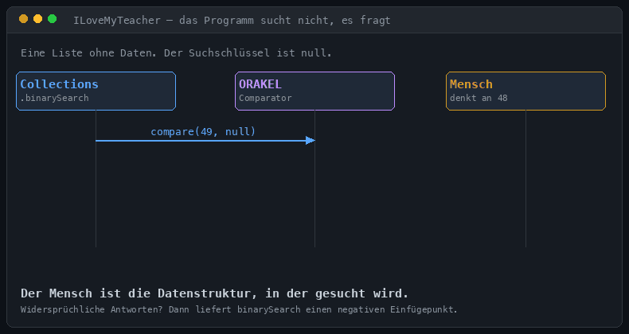
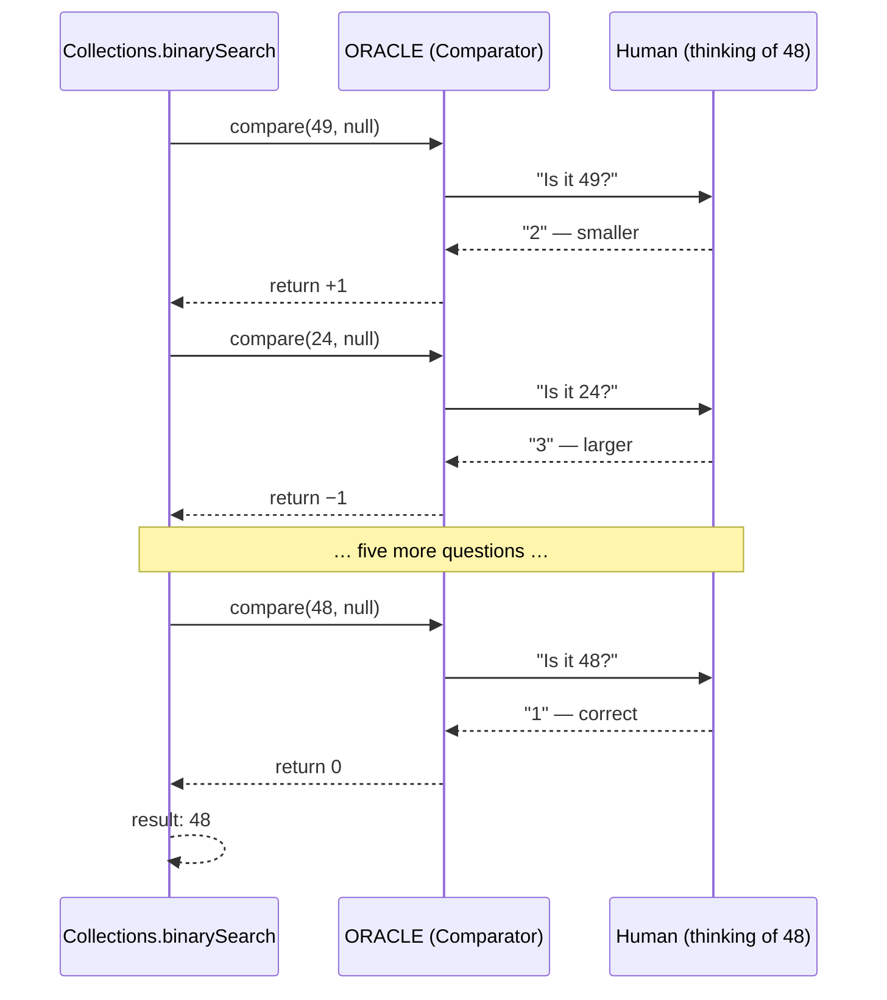

# 5 — `ILoveMyTeacher.java`: the program that does not search

[← back to the overview](../README.md) · source: [en](../src/en/ILoveMyTeacher.java) · [de](../src/de/ILoveMyTeacher.java) · 296 lines · 13,483 bytes · 3 warnings *(deliberate)*

[`Verflucht.java`](04-verflucht.md) still contained a binary search that someone
had written. This one does not. There is no loop over an interval anywhere in the
file, no `low`, no `high`, no comparison of a guess against a target.

**The central idea:** build an `AbstractList` that holds no data whatsoever, call
`Collections.binarySearch` on it with the search key `null`, and pass a comparator
that, on every comparison, asks the human.

> The human is the data structure being searched.

```sh
java src/en/ILoveMyTeacher.java     # Java 15+ (text blocks)
```

## How the search happens without a search





The three pieces:

```java
static final class Universe extends AbstractList<Integer> implements RandomAccess {
    public Integer get(int i) { return i; }          // the list "contains" i at index i
    public int size()         { return HIGH - LOW + 1; }
}

static final Comparator<Integer> ORACLE = (guess, nobody) -> {
    a += 1; а++;
    System.out.println(D[3] + guess + D[4]);         // "Is it guess?"
    return ask().value();                            // 1 → 0, 2 → +1, 3 → −1
};

int var = Collections.binarySearch(new Universe(), (Integer) null, ORACLE);
```

`Weltall` ("universe") stores nothing; `get(i)` simply returns `i`. The search key
is `null` and is never looked at, because the comparator ignores its second
argument entirely and asks a person instead.

**Cheat detection comes from the API contract.** `Collections.binarySearch` is
documented to return the index of the element, or `−(insertion point) − 1` if it
is not present. If the answers contradict each other, no index is consistent, and
the returned value is negative. The program checks `var < 0` and accuses you of
cheating. No code was written for that. It is a *documented guarantee* being used
for a purpose nobody intended. owo

## The twenty-two curses

| # | Curse | Specified by |
|---:|---|---|
| 1 | The filename is the decryption key: `class.getSimpleName()` unlocks the strings. Rename the file and the program stops speaking. | `Class.getSimpleName` |
| 2 | `Math.abs(Integer.MIN_VALUE) + Integer.MIN_VALUE` == 0, the lower bound. `abs` of `MIN_VALUE` is documented to be negative. | javadoc + JLS 15.18.2 |
| 3 | `"Aa".hashCode() - "BB".hashCode() + 0143` == 99, the upper bound. The two famous colliding strings, plus an octal literal. | `String.hashCode`, JLS 3.10.1 |
| 4 | A nested class named `System` that shadows `java.lang.System`. Every `System.out.println` in the file goes somewhere else. | JLS 6.4.1 |
| 5 | All text is an XOR-encrypted hex dump inside a text block. | JLS 3.10.6 |
| 6 | An entire class defined **inside a block comment**, escaped open with `*/`. | JLS 3.3 |
| 7 | Homoglyph identifiers: `a` (U+0061) and `а` (U+0430, Cyrillic) are two different variables that look identical. | JLS 3.8 |
| 8 | An `enum` with an abstract method *is* the 1/2/3 protocol. | JLS 8.9 |
| 9 | A list with no contents. | — |
| 10 | `Collections.binarySearch` searching for `null`, asking the human. | API contract |
| 11 | `short a += int` — compound assignment performs an implicit narrowing cast that plain `=` would reject. | JLS 15.26.2 |
| 12 | A static method invoked through a `null` reference: `NIEMAND.titel()` where `NIEMAND` is `null`. Does not throw, because the reference is only evaluated and discarded. | JLS 15.12.4.1 |
| 13 | A method defined **inside a line comment**, via `\u000a`. | JLS 3.3 |
| 14 | Which praise you get is decided by overload resolution: `lob(long)`, `lob(Integer)` and `lob(Object...)` are chosen by the three phases of method invocation. | JLS 15.12.2.2 |
| 15 | A label plus a `continue` that does nothing at all. | JLS 14.16 |
| 16 | `return` inside `finally` swallows a thrown `AssertionError`. | JLS 14.20.2 |
| 17 | `var` used as a variable name. It is a reserved *type* name, not a keyword. | JLS 3.9 |
| 18 | `switch` over a `String` with the colliding labels `"Aa"` and `"BB"` as accepted answers. | JLS 14.11 |
| 19 | `main` is empty; everything happens in a static initialiser. | JLS 12.4.1 |
| 20 | A labelled block with `break` used as `goto`. | JLS 14.15 |
| 21 | The shutdown hook builds its thank-you by splitting the class name on capitals: `I Love My Teacher`. | — |
| 22 | `if (false) …` still compiles, and is deliberately kept — only `while (false)` is an error. | JLS 14.21 |

## Four worth looking at closely

**Curse 6 — a class inside a comment.** JLS 3.3 requires Unicode escapes to be
translated before comments are recognised. `*/` *is* `*/`:

```java
/* From here on it's only prose, definitely no more code. */
static final class Ende extends Error {
    private static final long serialVersionUID = 1L;
    Ende() { super(null, null, false, false); }
}
/* And now, prose again. */
```

A reader sees a comment. The compiler sees a class. Both are right about the text
in front of them; only one of them read the spec.

**Curse 12 — calling a static method on `null`.**

```java
static final ILoveMyTeacher NIEMAND = null;
...
NIEMAND.titel();
```

This prints the banner and does not throw. JLS 15.12.4.1 says that for a `static`
method the reference expression is evaluated and then *discarded* — it is never
dereferenced. Every reviewer will tell you this is a guaranteed NPE. It is
guaranteed not to be.

**Curse 14 — the praise is chosen by overload resolution.**

```java
static String praise(long n)      { ... }   // "Well, that was easy!"
static String praise(Integer n)   { ... }   // "Found it!"
static String praise(Object... n) { ... }   // "Phew, that was tricky."

a <= 5 ? praise(a)                              // short → long: widening, phase 1
      : a <= 6 ? praise(Integer.valueOf(a))     // boxing, phase 2
               : praise((Object[]) new Object[]{ a })   // varargs, phase 3
```

The three phases of method invocation (strict, loose, variable-arity) pick a
different message each time. The branch condition is real, but the mechanism
carrying it is the compiler's overload resolution algorithm.

**Curse 16 — `finally` eats an `AssertionError`.**

```java
static int ziffer(String z) {
    try { throw new AssertionError(D[10]); }
    finally { return z.charAt(0) - '0'; }
}
```

The `throw` always executes. The `finally` always returns. Abrupt completion of
`finally` discards the pending exception (JLS 14.20.2), so the method reliably
returns a digit and the `AssertionError` is never seen by anyone.

## What was rejected

One trick was cut on purpose: identifiers differing only by zero-width joiners
(`T` vs `T‍`). javac collapses identifier-ignorable characters and rejects
the second as a duplicate — but that is *javac behaviour*, not something the JLS
guarantees. The whole point of both cursed versions is that they rely only on
specified behaviour, so it had to go. Homoglyphs (curse 7) do the same job with
full backing from JLS 3.8.

## About those three warnings

```
[cast]    redundant cast to Object[]
[static]  static method should be qualified by type name, ILoveMyTeacher,
          instead of by an expression
[finally] finally clause cannot complete normally
```

Curse 14, curse 12 and curse 16 respectively. The compiler is describing the
crimes accurately.

## Honest caveat

The `Collections.binarySearch` contract guarantees the **result** — the index, or
a negative insertion point — not the specific sequence of probes. The measured
worst case of 7 questions holds on OpenJDK, where `AbstractList` implementing
`RandomAccess` with fewer than 5000 elements takes the indexed binary-search path.
On any conforming implementation the program remains *correct*; only the exact
questions could differ.

## Measured

| | |
|---|---|
| all 100 numbers found | ✅ |
| guesses min / mean / max | 1 / 5.80 / 7 |
| runtime for 100 rounds | 0.4 s |
| `javac -Xlint:all` | 3 warnings, all intended |

→ [How this was measured](measurement.md)
