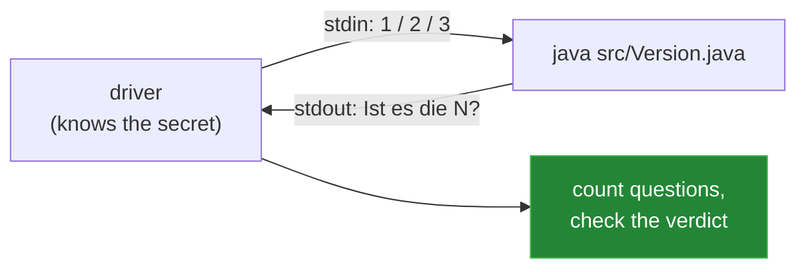

# How this was measured

[← back to the overview](../README.md)

Every number in this repository comes from actually running the programs, not
from reasoning about them. The scripts live in [`tools/`](../tools) and are
plain Python 3 with no dependencies except Pillow for the animations.

## The harness

All five programs speak the same protocol, which makes them interchangeable in a
driver: a line matching `Ist es die (\d+)?` is a question, and the driver replies
with `1`, `2` or `3` depending on the secret number it has chosen.



Because the driver talks to the process rather than calling into it, the cursed
versions get measured exactly like the normal one — no special cases anywhere.

## The exhaustive benchmark

`tools/vergleich.py` plays **all 100 numbers, 0 through 99, in a single process**,
using the program's own replay loop. That is a stricter test than 100 separate
launches: state left over between rounds would show up immediately.

```sh
python3 tools/vergleich.py
```

Result for every one of the five:

| | min | mean | max |
|---|---:|---:|---:|
| questions per round | 1 | **5.80** | 7 |

5.80 is not an approximation. Summed over all 100 numbers, optimal binary search
needs exactly 580 questions:

| questions | numbers reachable |
|---:|---:|
| 1 | 1 |
| 2 | 2 |
| 3 | 4 |
| 4 | 8 |
| 5 | 16 |
| 6 | 32 |
| 7 | 37 |
| **total** | **100** |

`1·1 + 2·2 + 3·4 + 4·8 + 5·16 + 6·32 + 7·37 = 580`, and 580 / 100 = 5.80. Hitting
that number means a version is not merely good, it is optimal.

## The edge cases

`tools/randfaelle.py` runs six scenarios against each of the five programs:

| Scenario | Expected |
|---|---|
| always answer "smaller" | cheat detected, exits cleanly |
| always answer "larger" | cheat detected, exits cleanly |
| garbage input (`x`, `42`, empty, `1`) | re-prompts, then continues normally |
| three rounds in a row | counter resets per round, totals correct |
| EOF immediately at start | goodbye, exit code 0 |
| EOF in the middle of a round | goodbye, exit code 0, statistics intact |

All 30 combinations pass, all exit 0.

> One lesson from writing these: when a test failed, it was worth asking which
> side was wrong. One assertion searched the output for `Versuche)` and broke on
> the number 49, which is found in a single question and therefore correctly
> prints `Versuch)`. The test was the bug, not the program.

## Compiler warnings

```sh
javac -Xlint:all -d /tmp/out src/<Version>.java
```

| Version | Warnings |
|---|---|
| `Rater.java` | 0 |
| `NeuralGuesser.java` | 0 |
| `NG.java` | 0 |
| `Verflucht.java` | 4 — all deliberate |
| `ILoveMyTeacher.java` | 3 — all deliberate |

The warnings on the cursed versions are listed and attributed to individual
curses in [their](04-verflucht.md) [write-ups](05-ilovemyteacher.md).

## The animations

`tools/media_bauen.py` renders all four GIFs in [`media/`](../media) with Pillow.
Nothing in them is mocked up:

| File | Content | Source of the data |
|---|---|---|
| `spiel.gif` | a full round against the number 48 | actual captured output |
| `intervall.gif` | how the interval halves | computed from the same round |
| `lernkurve.gif` | `mu` and the mean guess count over 3000 iterations | captured from a real training run |
| `orakel.gif` | the `binarySearch` ↔ comparator ↔ human handshake | traced from an actual run |

```sh
python3 tools/media_bauen.py
```

## Caveats worth repeating

- The ML versions train fresh on each launch with **no fixed seed**. The numbers
  they report about themselves (5.75…5.85) are sampling noise from a few thousand
  random evaluation games; the exhaustive run is the exact one and always says
  5.80.
- For `ILoveMyTeacher.java` the `Collections.binarySearch` contract fixes the
  *result*, not the probe sequence. The measurements describe OpenJDK 21.0.2.
- Runtimes are wall-clock on one machine and only meant to show the difference
  between "trains a network first" (≈ 4.5 s) and "does not" (≈ 0.4 s).
